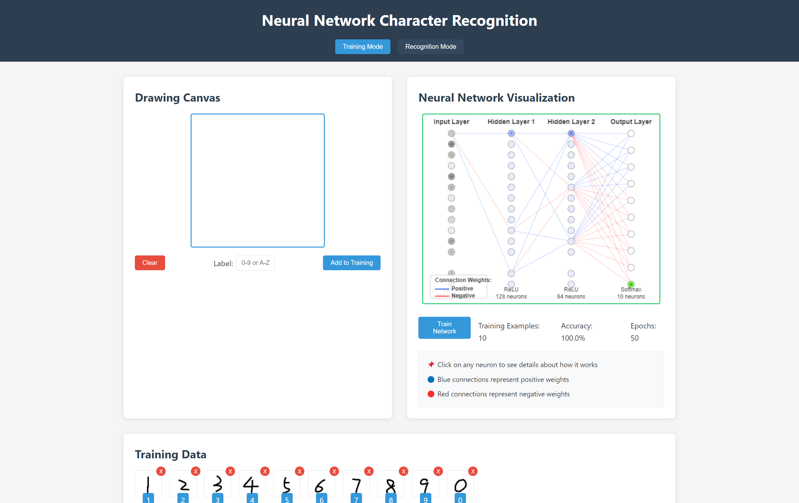

# Neural Network Character Recognition

<div align="center">
    
    <p><em>Interactive neural network visualization for handwritten character recognition</em></p>
</div>

## 📋 Overview

This interactive web application demonstrates the power of neural networks for handwritten character recognition. Users can draw characters, train a custom neural network model, and visualize how the network processes data and makes decisions in real-time.

The project combines an intuitive drawing interface with a sophisticated neural network visualization that reveals the inner workings of artificial intelligence, making machine learning concepts accessible and engaging.

### 🎮 [Live Demo](https://neural-network-character-recognition.onrender.com) | [Video Tutorial](#)

## ✨ Key Features

- **🖌️ Interactive Drawing Canvas**: Draw characters with mouse or touch input
- **🧠 Real-time Neural Network Visualization**: See neurons activate as data flows through the network
- **🔍 Neuron Inspection**: Click on neurons to view detailed information about their function and activation
- **🏋️ Custom Training**: Train the network with your own handwritten examples
- **🔄 Data Augmentation**: Automatically enhances your training data with variations for better accuracy
- **💾 Persistent Models**: Trained models are saved in your browser for future use
- **📊 Recognition Statistics**: View confidence scores for predictions

## 🖼️ Screenshots

<div align="center">
    
    
    <p><em>Left: Training Mode - Right: Recognition Mode</em></p>
</div>

## 🧠 Neural Network Architecture

This application implements a convolutional neural network (CNN) optimized for character recognition:

| Layer Type | Details | Activation |
|------------|---------|------------|
| **Input** | 28×28 pixels (784 neurons) | - |
| **Conv2D** | 32 filters, 3×3 kernel, stride 1 | ReLU |
| **MaxPooling2D** | 2×2 pool size | - |
| **Conv2D** | 64 filters, 3×3 kernel, stride 1 | ReLU |
| **MaxPooling2D** | 2×2 pool size | - |
| **Flatten** | - | - |
| **Dense** | 128 neurons | ReLU |
| **Dropout** | 0.3 rate | - |
| **Output** | Dynamic size based on classes | Softmax |

## 🚀 Getting Started

### Prerequisites

- Node.js (v12 or higher)
- npm or yarn

### Installation

1. Clone the repository:
```bash
git clone https://github.com/HaolongChen/neural-network-character-recognition.git
cd neural-network-character-recognition
```

2. Install dependencies:
```bash
npm install
```

3. Start the server:
```bash
npm start
```

4. Open your browser and navigate to:
```
http://localhost:3000
```

## 📖 How to Use

### Training the Network

1. Ensure you're in "Training Mode" (selected by default)
2. Draw a character on the canvas
3. Enter a label for your drawing (e.g., "A", "7", "α", etc.)
4. Click "Add to Training"
5. Repeat with multiple examples of different characters (8-10 examples per character recommended)
6. Click "Train Network" to begin training
7. Watch the neural network visualization during training

### Recognizing Characters

1. Switch to "Recognition Mode"
2. Draw a character on the canvas
3. Click "Recognize"
4. View the prediction and confidence levels
5. Observe how data flows through the network

### Neural Network Visualization Tips

- **Neuron Colors**: Brighter colors indicate higher activation
- **Connection Colors**: 
  - Blue lines represent positive weights
  - Red lines represent negative weights
- **Interactive Features**:
  - Click on any neuron to view its details
  - Watch activation patterns during recognition

## 🧩 Project Structure

```
neural-network/
├── public/                   # Frontend assets
│   ├── css/                  # Stylesheets
│   │   └── style.css         # Main application styles
│   ├── js/                   # JavaScript files
│   │   ├── app.js            # Main application logic
│   │   ├── drawing.js        # Canvas drawing functionality
│   │   ├── network.js        # Neural network implementation
│   │   └── visualization.js  # Network visualization
│   └── index.html            # Main HTML file
├── screenshots/              # Project screenshots for documentation
├── server.js                 # Express server
├── package.json              # Project dependencies and scripts
├── LICENSE                   # MIT License
└── README.md                 # Project documentation
```

## 🔧 Technologies Used

- **Frontend**: HTML5, CSS3, JavaScript (ES6+)
- **Neural Networks**: TensorFlow.js
- **Visualization**: Canvas API
- **Server**: Node.js with Express

## 🛠️ Technical Implementation

- **Data Processing**: Input drawings are normalized and centered
- **Data Augmentation**: Training examples are augmented with shifts and rotations
- **Model Architecture**: Convolutional neural network optimized for character recognition
- **Visualization**: Custom-built neural network visualization system

## 🔮 Future Improvements

- [ ] Export and import trained models
- [ ] Advanced model architectures (LSTM, Transformers)
- [ ] Multi-touch drawing support
- [ ] Batch training and dataset import
- [ ] Model performance metrics and confusion matrix
- [ ] Preset models for common characters (letters, digits)

## 🤝 Contributing

Contributions are welcome! Please feel free to submit a pull request.

1. Fork the repository
2. Create your feature branch (`git checkout -b feature/amazing-feature`)
3. Commit your changes (`git commit -m 'Add some amazing feature'`)
4. Push to the branch (`git push origin feature/amazing-feature`)
5. Open a Pull Request

## 📜 License

This project is licensed under the MIT License - see the [LICENSE](LICENSE) file for details.

## 👏 Acknowledgments

- TensorFlow.js team for their exceptional machine learning library
- The open-source community for various inspirations and resources
- All contributors who help improve this project

## 📬 Contact

Project Link: [https://github.com/HaolongChen/neural-network-character-recognition](https://github.com/HaolongChen/neural-network-character-recognition)

---

<div align="center">
    <p>If you found this project interesting, please consider giving it a star ⭐</p>
    <p>Made with ❤️ for neural networks</p>
</div>